<br />
<div align="center">
	<a href="[Repo Link](https://github.com/DarioArzaba/TheHearthOfDevSite.git)">
		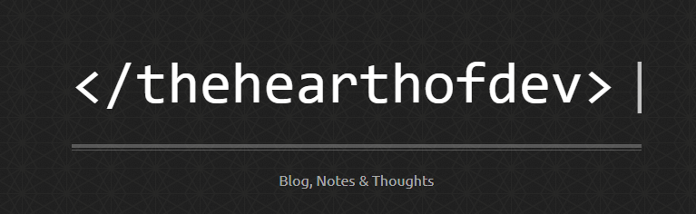
	</a>
	<h3 align="center">The Hearth of Dev (OG Blog)</h3>
	<p align="center">
    	Historical repository of the different versions my website has gone through.
  	</p>
</div>


## About

This is the history of how I started developing my personal website originally titled **The Hearth of Dev** since developing code has always been a warm place for me, like standing near a cozy fire. 

I still remember my humble beginnings when I knew absolutely *nothing* about programming (had my first proper programming class until university).

Despite the fact that the years passed and I have refactored and adapted my website innumerable times I still remember clearly when I created the `favicon.ico` for the first version pixel by pixel, and it's the only thing that I continue using to this very day:

<div align="center">
	
</div>

## Installation

1. Clone the repo
   ```sh
   git clone https://github.com/DarioArzaba/TheHearthOfDevSite.git
   cd TheHearthOfDevSite
   ```
3. Open the `index.html` file from any of the 3 `Ver` folders.

## Versions

<details>
<summary> Version 1 (2010 - 2014) </summary>

</br>

My first proper website, I started developing this in Middle School many years ago and have fond memories of spending some afternoons tweaking it to my hearts content from a humble Hello World html file. Sadly I didn't record most of my early years of software and web development and the many design iterations it went through have been lost to time.

This is the last version of the site that I saved, the scrolling bar at the homepage was very important for me at that time since I wanted the site to work with touchscreen devices (with iPhone compatibility in mind).

<div align="center"> <p> Homepage typewriter effect and responsive title </p> </div>
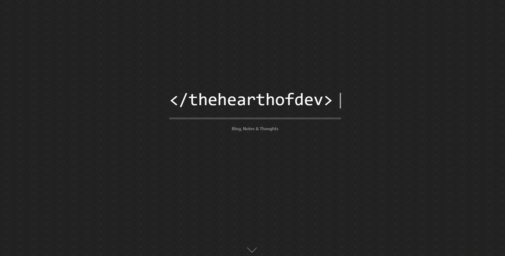
<div align="center"> <p> Showcase of pages using horizontal scrolling bar </p> </div>
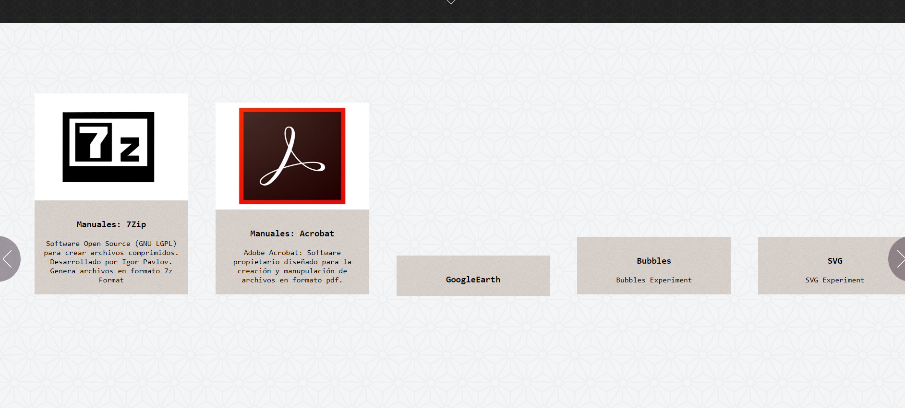
<div align="center"> <p> Created a folding effect on the top link </p> </div>
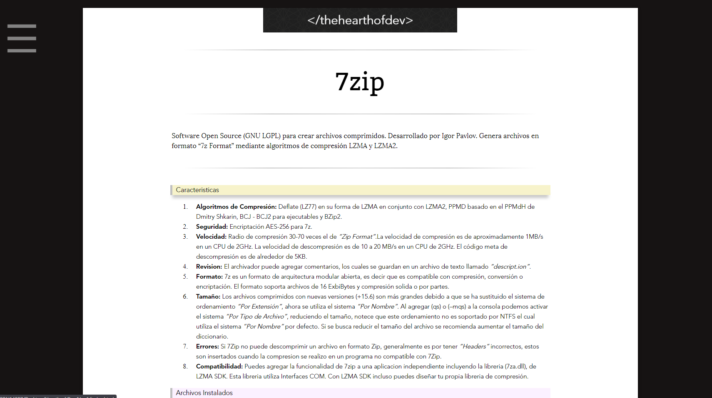
<div align="center"> <p> Extensive use of collapsible sections </p> </div>
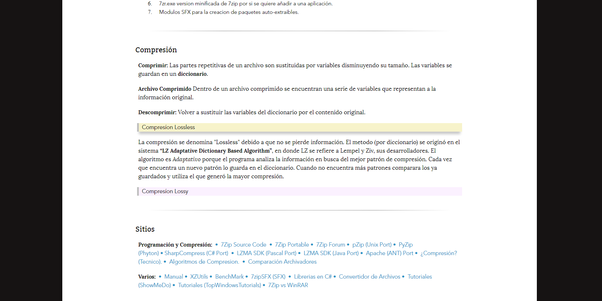
<div align="center"> <p> Book-feel design with compact fonts </p> </div>
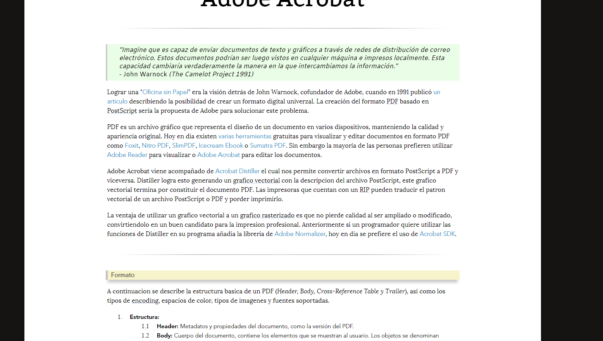

</details>


<details>
<summary> Version 2 (2015 - 2018) </summary>

</br>

In this version I started using text tooltips, focused more on obtaining a layout balance and cleaner fonts. In the landing page I opted for Gifs to promote each page instead of the scrolling bar of Version 1.

<div align="center"> <p> Beautiful use of interactive chess board </p> </div>
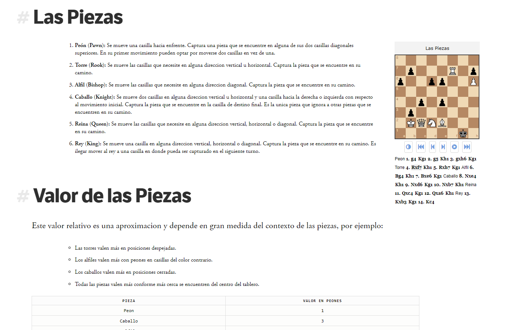
<div align="center"> <p> Interactive math explanations using JSXGraph </p> </div>
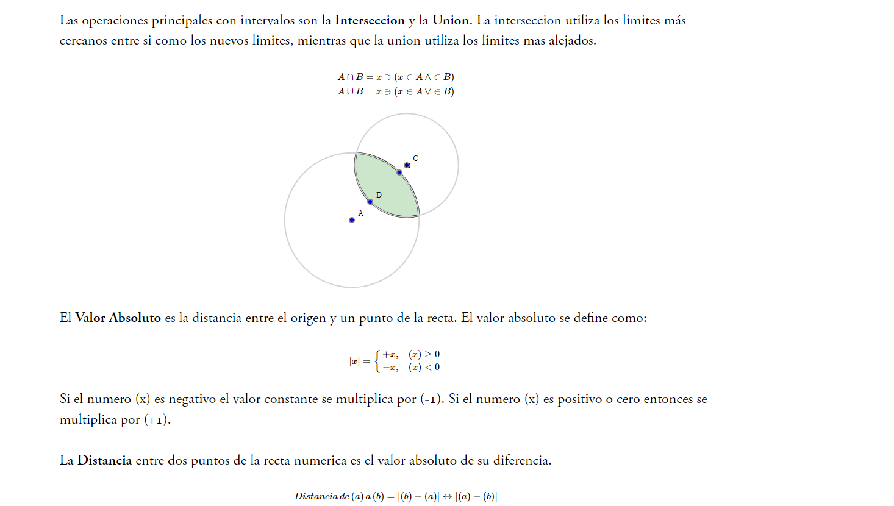
<div align="center"> <p> Kept folding CSS effect on top link </p> </div>
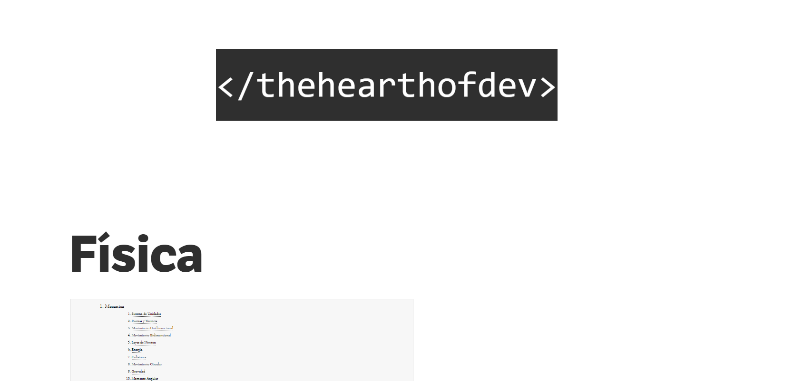
<div align="center"> <p> Landing Page with GIFs for each Post </p> </div>
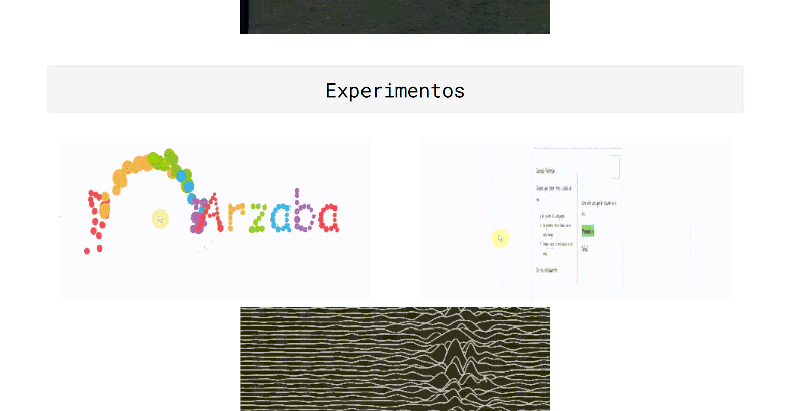
<div align="center"> <p> Use of clear font with Math integration </p> </div>
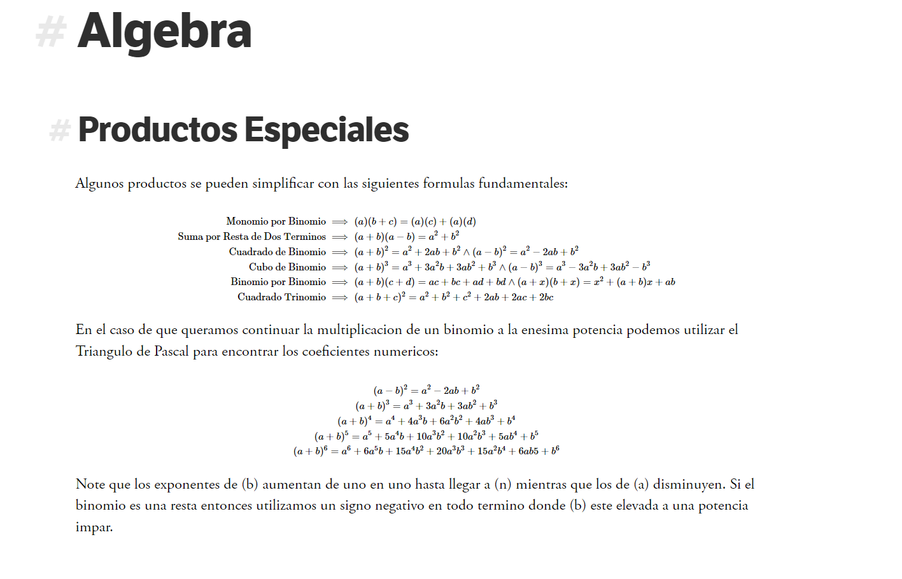
<div align="center"> <p> Prism for code highlighting </p> </div>
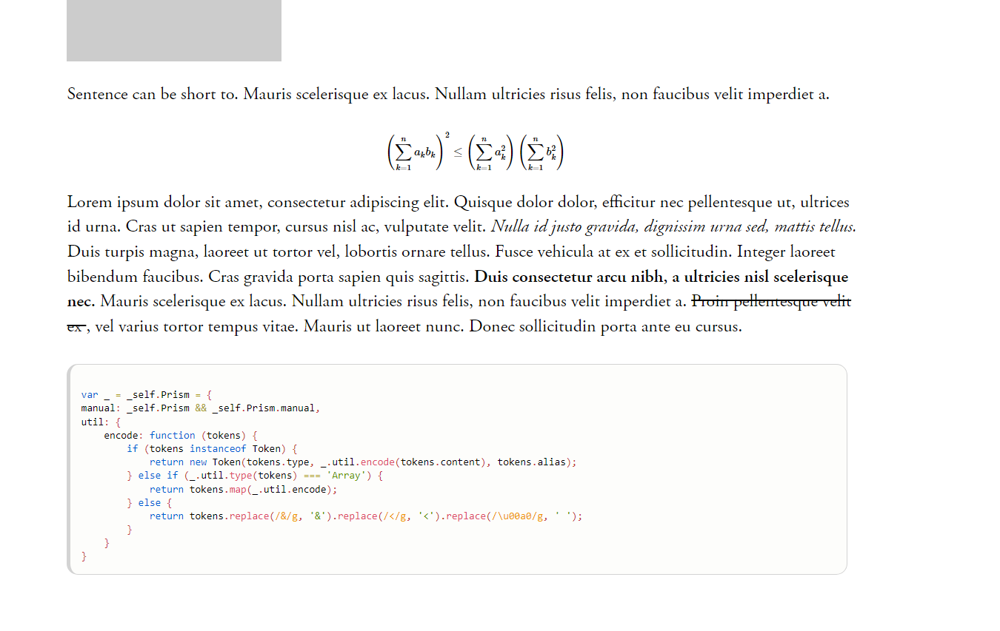

</details>

<details>
<summary> Version 3 (2019 - 2020) </summary>

</br>

With the use of static site generators such as Jekyll (endorsed by GitHub) I started delving into automating certain aspects of my site instead of doing everything by hand. In this version I included a robots file, google analytics, RSS Feed, Tags, 404 custom page and in general a more responsive layout.

<div align="center"> <p> Landing page with particles.js effect on top </p> </div>
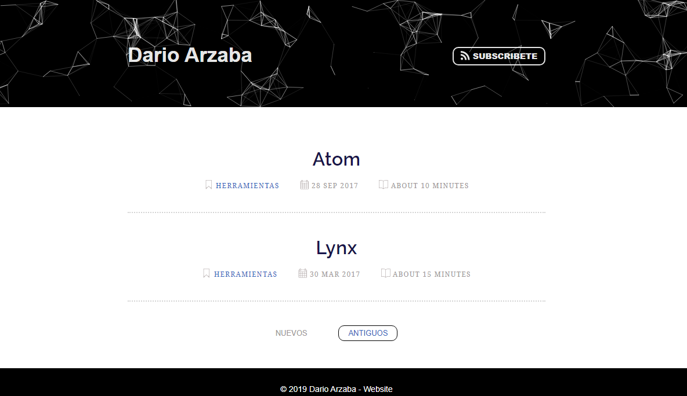
<div align="center"> <p> List of posts with YouTube videos and cleaner fonts </p> </div>
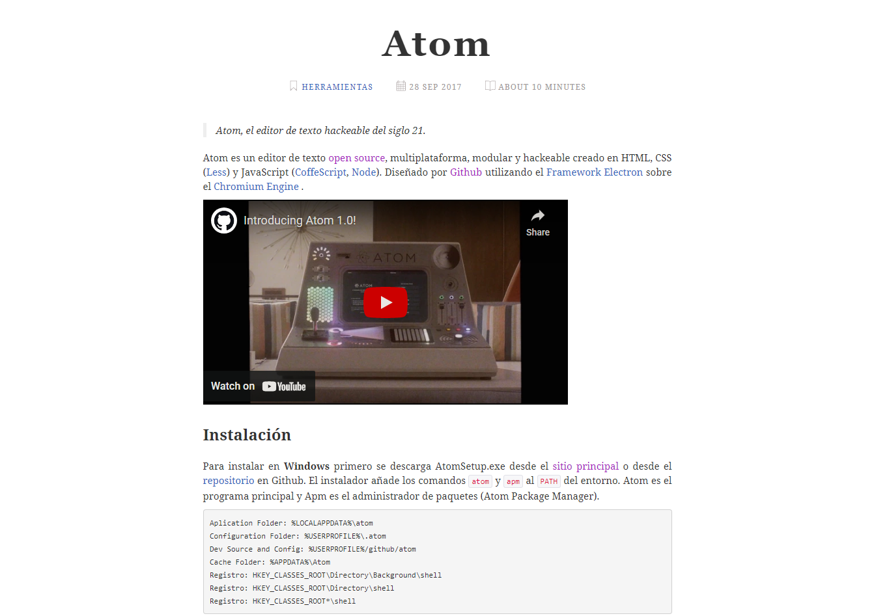
<div align="center"> <p> End of posts with sharing buttons and Disqus comments </p> </div>
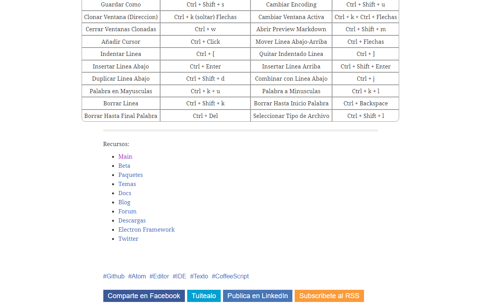
<div align="center"> <p> Cleaner reading and subtle formatting from markdown </p> </div>
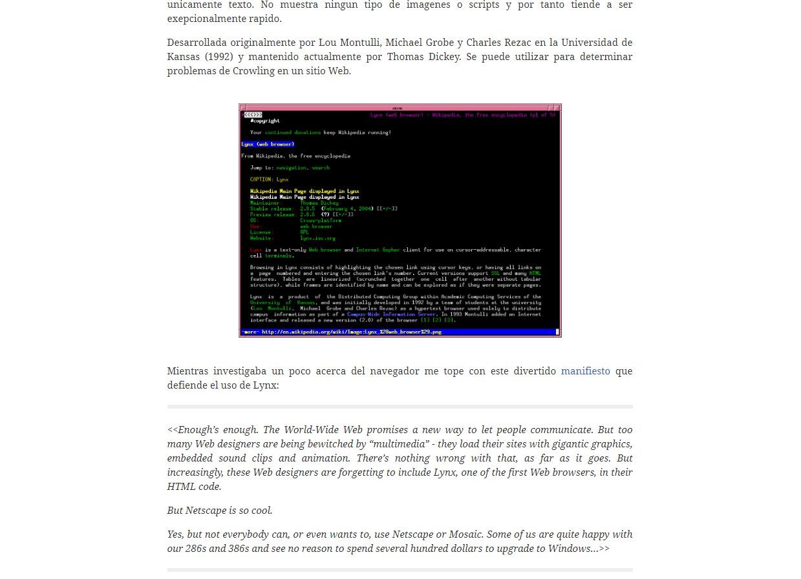

</details>

<details>
<summary> Version 4 (2021 - 2022) </summary>

</br>

The last version before the site I'm currently using can be found in this repository:

* [My (Old) Personal Blog](https://github.com/DarioArzaba/DarioArzaba.github.io)

In 2023 I refactored my website from using Jekyll to Next.js, React and Tailwind resulting in a much better experience and the added benefit of JS inside MDX.

</details>

## License

Distributed under the [MIT License](https://mit-license.org/).

## Contact

Dario Arzaba - dario.arzaba@gmail.com